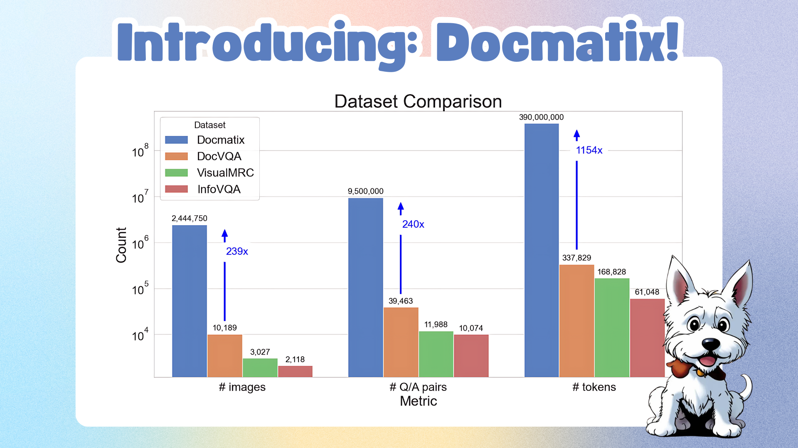

# Docmatix

Docmatix is a comprehensive dataset designed for Document Visual Question Answering (DocVQA). It provides a robust collection of document images paired with corresponding questions and answers to facilitate research and development in the field of visual question answering on document images.

## This repository

This repository includes all the code used to generate Docmatix.

## Dataset

The dataset includes:

- A variety of document images.
- Question-answer pairs for each document.
- Annotations to facilitate training and evaluation of DocVQA models.

## License

This project is licensed under the MIT License. See the LICENSE file for details.